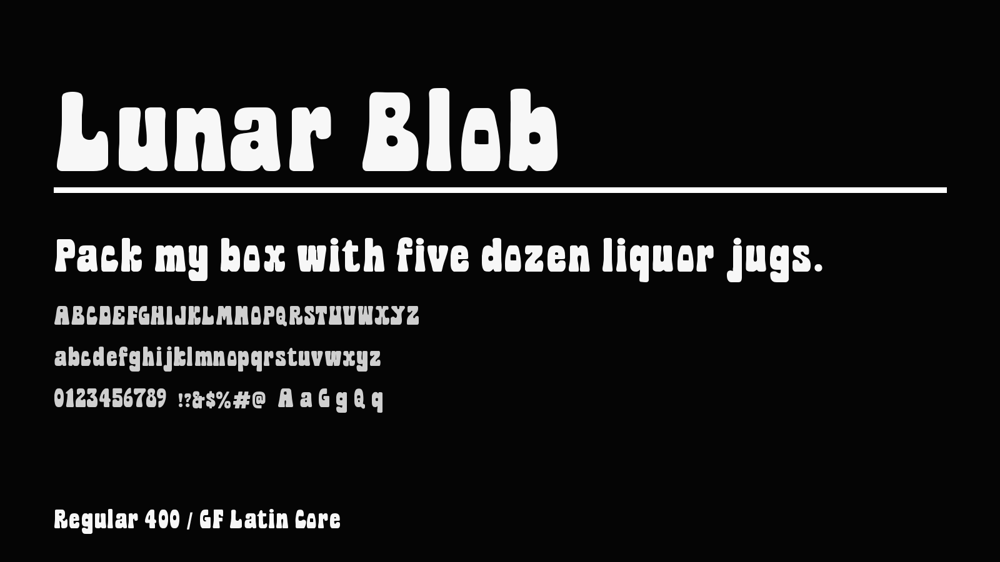

# Lunar Blob

Lunar Blob is a rounded display sans-serif with dense, bubbly letterforms and a
playful grotesque structure. It is built for expressive headlines, posters,
game UI, packaging, and brand work.



## Status

- License: SIL Open Font License 1.1
- Current style: Regular 400
- Font file: `fonts/ttf/LunarBlob-Regular.ttf`
- Coverage: GF Latin Core
- Google Fonts QA: 0 FAIL / 12 WARN
- Upstream: https://github.com/mixfont/lunar-blob

## Files

- `fonts/ttf/`: release TTF files
- `documentation/`: description, article, and specimen assets
- `sources/`: editable source files and build scripts
- `templates/googlefonts/`: draft package files for `google/fonts`
- `scripts/qa.sh`: Google Fonts QA helper
- `scripts/repair_current_ttf.py`: temporary binary repair script until source-based builds are in place

## Development

Install the QA tools:

```sh
python3 -m venv .venv
. .venv/bin/activate
pip install -r requirements-dev.txt
```

Regenerate the current repaired TTF metadata and run QA:

```sh
scripts/repair_current_ttf.py
scripts/qa.sh
```

## Google Fonts

This repo has the public upstream URL, OFL license, authorship files,
documentation, and repaired TTF needed for Google Fonts review. The remaining
submission blocker is source compliance: Google Fonts expects editable sources
in `sources/` and a one-command open-source build that reproduces the TTF.

The final Google Fonts package should be prepared under `ofl/lunarblob/` in a
fork of `google/fonts`. See `docs/google-fonts-submission.md` for the full
checklist.

